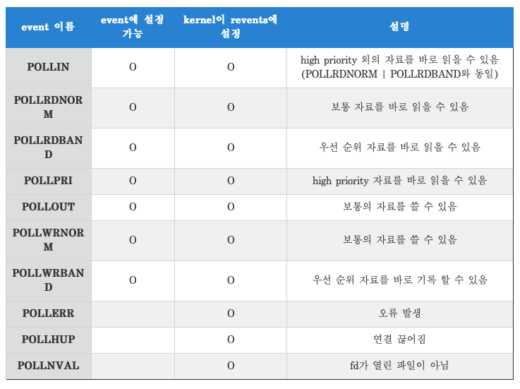

# IRC
make IRC protocol Server

## IRC란
Internet Relay Chat의 약자로 실시간 기본 채팅서비스 입니다.
소켓 프로그래밍으로 서버에서 클라이언트의 연결 요청이 오면 클라이언트와 연결을 맺고 소켓을 만듭니다.

## 구현한 명령어
* PASS
서버에 연결을 시도할 때, 서버에 패스워드를 전송하는 데 사용됩니다.
* NICK
서버에 처음 연결할 때, 그리고 연결 후에 클라이언트가 자신의 닉네임을 변경하고자 할 때 사용됩니다.
* USER
서버에 처음 연결할 때 클라이언트의 정보를 서버에 전달하는 데 사용됩니다.
* PING
서버나 클라이언트가 연결이 여전히 활성인지 확인하기 위해 사용됩니다.
* JOIN
클라이언트가 특정 채널에 참여하고자 할 때 사용됩니다. 
* PART
클라이언트가 하나 이상의 채널에서 나가고자 할 때 사용됩니다.
채널의 다른 클라이언트들은 해당 클라이언트가 채널을 떠났다는 알림 메시지를 받게 됩니다.
* PRIVMSG
개인 메시지를 보내거나 채널에 메시지를 보내는 데 사용됩니다.
* NOTICE
다른 클라이언트나 채널에 메시지를 전송하는 데 사용되지만, PRIVMSG와는 약간의 차이가 있습니다. NOTICE 메시지는 일반적으로 자동 응답 또는 서비스 메시지를 전달하는 데 사용되며, NOTICE 메시지를 받은 클라이언트는 이에 대해 응답을 전송해서는 안 됩니다.
* QUIT
클라이언트가 서버와의 연결을 종료하고자 할 때 사용됩니다.
* OPER
클라이언트가 IRC 오퍼레이터(IRC Operator 또는 IRCop이라고도 함) 권한을 얻기 위해 사용됩니다. IRC 오퍼레이터는 IRC 서버나 네트워크에 대해 관리 권한을 갖는 클라이언트로, 특별한 명령어를 사용할 수 있고, 클라이언트를 추방하거나 밴(ban)할 수 있습니다.
* KICK
채널의 오퍼레이터(또는 누군가에게 해당 권한이 부여된 클라이언트)가 특정 클라이언트를 채널에서 제거할 때 사용됩니다. 
* INVITE
다른 클라리언트를 특정 채널에 초대하는 데 사용됩니다.
* TOPIC
채널의 주제(topic)을 설정하거나 조회하는 데 사용됩니다.
* MODE
채널의 모드(mode)를 변경하는 데 사용됩니다.

## 소켓
socket() - 소켓을 생성합니다.
bind() - ip와 port 번호를 설정합니다.
listen() - 클라이언트 접근 요청 수신 대기열을 생성합니다.
accept() - 클라이언트와의 연결을 기다립니다.

## 멀티플렉싱
### poll
여러 file descriptor에 대해서 I/O를 수행하기 위한 준비가 될 때까지 기다리는 함수입니다. 여러 file descriptor를 감시하여 event가 발생할 때까지 기다립니다.

```c++
int poll(struct pollfd *fds, nfds_t nfds, int timeout);
```
- fds
```c++
struct pollfd {
   int   fd;         /* file descriptor */
   short events;     /* requested events */
   short revents;    /* returned events */
};
```
fd - file descriptor입니다.
events - fd에 대해서 주시할 event입니다.
revents - fd에 발생한 event를 의미합니다.


이 이벤트들 중 POLLIN, POLLHUP, POLLNVAL 3개의 이벤트를 사용해 서버를 구현했습니다.

```c++
void Server::server_run()
{
    int ret = 0;

    while (1)
    {
		ret = poll(_pollfd_vec.data(), _pollfd_vec.size(), 1000);
        if (ret < 0)
            throw std::runtime_error("Error : poll failed");
        // server fd
        if (_pollfd_vec[0].revents & POLLIN)
            accept_client();
        // client fd
        for (pollfd_vec::iterator iter = _pollfd_vec.begin() + 1; iter < _pollfd_vec.end(); ++iter)
        {
            // client receive
            if (iter->revents & POLLIN)
            {
                if (!recv_message((*iter).fd))
                {
                    iter = _pollfd_vec.erase(iter);
                    continue;
                }
            }
            // client disconnect
            if (iter->revents & POLLHUP || iter->revents & POLLNVAL)
            {
                Command command("QUIT :leaving");
                command.cmd_quit(*this, (*iter).fd);
                iter = _pollfd_vec.erase(iter);
                continue;
            }
        }
    }
}
```
***
```c++
ret = poll(_pollfd_vec.data(), _pollfd_vec.size(), 1000);
        if (ret < 0)
            throw std::runtime_error("Error : poll failed");
```
poll함수의 리턴값을 받아 서버는 클라이언트와의 통신 상태를 관리하고 클라이언트의 요청을 처리합니다.
```c++
if (_pollfd_vec[0].revents & POLLIN)
            accept_client();
```
서버소켓에서 POLLIN이벤트가 발생시 클라이언트를 수학해줍니다. 
```c++
for (pollfd_vec::iterator iter = _pollfd_vec.begin() + 1; iter < _pollfd_vec.end(); ++iter)
        {
            // client receive
            if (iter->revents & POLLIN)
            {
                if (!recv_message((*iter).fd))
                {
                    iter = _pollfd_vec.erase(iter);
                    continue;
                }
            }
            // client disconnect
            if (iter->revents & POLLHUP || iter->revents & POLLNVAL)
            {
                Command command("QUIT :leaving");
                command.cmd_quit(*this, (*iter).fd);
                iter = _pollfd_vec.erase(iter);
                continue;
            }
        }
```
* 클라이언트의 fd값이 들어있는 벡터를 순회하면서 이벤트가 발생한 클라이언트의 요청을 처리해줍니다.
* POLLIN을 통해 서버가 요청하는 커맨드들을 처리할 수 있습니다.
* POLLHUP과 POLLNVAL을 통해 클라이언트와의 연결이 끊어질 경우 클라이언트의 종료를 안전하게 처리하고 정리작업을 수행합니다.